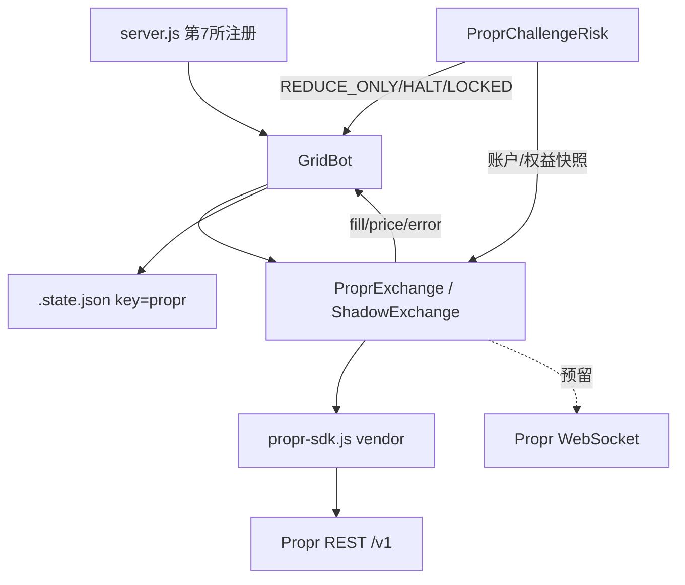
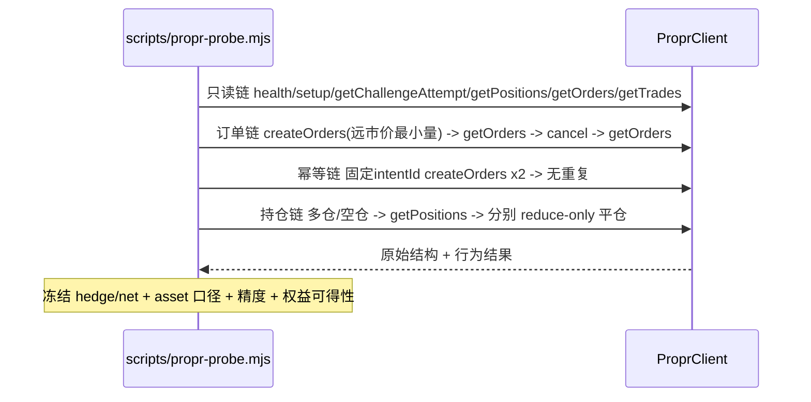

# 技术设计: 接入 Propr 挑战账户（BTC 中性网格 + 挑战风控）

## 技术方案

### 核心技术
- **语言/运行时:** Node.js ≥20 ESM（与现有适配器一致，零构建）
- **Propr 客户端:** vendor 官方 JS SDK 源码为 `src/exchange/propr/propr-sdk.js`（ESM），保留 `ProprClient` / `ProprAPIError` / 类型定义；新增运行时依赖 `ulid`（intentId 生成）
- **HTTP:** 原生 `fetch`（Node 18+），超时用 `AbortController`；错误统一映射为项目内 `ProprError`
- **复用:** 沿用现有 `EventEmitter` 适配器契约（`fill` / `price` / `error`）与 `GridBot`，不重写 `grid.js`

### 四级运行模式（ADR-006）

| 能力 | `paper` | `shadow` | `sim-write` | `challenge` |
|---|---|---|---|---|
| 访问 Propr API | ❌ | ✅ 只读 | ✅ 读写 | ✅ 读写 |
| 写 Propr（下单/撤单/设杠杆） | ❌ | ❌ **硬禁止** | ✅ | ✅ |
| 本地模拟成交 | ✅ | ✅ | ❌（真实模拟盘成交） | ❌ |
| 账户性质 | 无 | Free Trial（只读） | Free Trial（模拟盘） | 付费 Challenge（模拟盘） |
| 真实资金 | ❌ | ❌ | ❌ | ❌ |
| 额外护栏 | — | 写方法抛错 + 锁定 | 账户白名单 | 白名单 + `PR_ALLOW_CHALLENGE=YES` + 手动确认 |

模式常量：`PR_MODE=paper|shadow|sim-write|challenge`。**不使用 `live` 一词**，避免与"真实资金"混淆。

### 实现要点

1. **配置**（`src/config.js` 新增 `propr` 块，紧邻 `hl`/`va`；`getConfig()` 返回值暴露）：
   ```
   PR_MODE=paper|shadow|sim-write|challenge   # 默认 paper
   PROPR_API_KEY=                # 仅经 .env，不入库、不入日志
   PROPR_API_URL=https://api.propr.xyz/v1
   PROPR_WS_URL=wss://api.propr.xyz/ws
   PROPR_ACCOUNT_ID=             # shadow/sim-write/challenge 必填（禁止自动发现）
   PROPR_ALLOWED_ACCOUNT_IDS=    # 逗号分隔白名单；不在其中则拒绝启动
   PR_ALLOW_CHALLENGE=NO         # challenge 模式必须显式置 YES
   PR_BASE=BTC
   PR_LEVERAGE=1
   PR_POSITION_MODE=auto|hedge|net   # auto=探针判定
   PR_OUT_OF_RANGE_ACTION=close
   PR_ENABLE_AUTO_RECENTER=false
   PR_INTERNAL_DAILY_STOP_PCT=0.01
   PR_INTERNAL_MAX_DRAWDOWN_PCT=0.03
   PR_ORDER_POLL_MS=3000
   PR_TRADE_POLL_MS=3000
   PR_RECONCILE_MS=15000
   PR_TIMEOUT_MS=30000
   ```

2. **工厂分流**（`index.js`）：`paper → PaperExchange`；`shadow → ShadowExchange`（读 Propr + 本地撮合，写方法直接抛错）；`sim-write|challenge → ProprExchange`（真实 API），并在 `challenge` 加硬确认。`init()` 执行启动校验链：`health → healthServices → getUser → setup(accountId) → getChallengeAttempt → getMarginConfig('BTC') → getLeverageLimits → getPositions({base:'BTC',status:'open'})`；任一项异常则保持 `TRADING_LOCKED`。

3. **字段映射**（`mapper.js`，纯函数，全部可单测）：

   | 项目内部 | Propr 字段 | 处理 |
   |---|---|---|
   | `orderId` | `Order.orderId` | 直接 |
   | `clientOrderId` | `Order.intentId` | **保真**，作为幂等键 |
   | `side` | `Order.side` | `buy/sell` |
   | `positionSide` | `Order/Position.positionSide` | **保真 long/short** |
   | `reduceOnly` | `Order.reduceOnly` | 直接 |
   | `price` | `Order.price` | 字符串→Number（展示）；下单用字符串 |
   | `sizeBase` | `Order.quantity` / `Position.quantity` | 字符串→Number |
   | `status` | `Order.status` | 见状态机 |
   | `entryPrice` | `Position.entryPrice` | 直接 |
   | `unrealizedPnl` | `Position.unrealizedPnl` | 直接 |
   | `marketId` | `base`（如 `BTC`） | 内部用字符串 `'BTC'` 作 marketId |
   | `createdAt` | `Order.createdAt` | ISO→epoch ms |

   `getMarkets()` 由 `getMarginConfig('BTC')` + `getLeverageLimits()` + 常量表构建；`maxLeverage` 取 `overrides.BTC ?? defaultMax`，但**受挑战规则再收敛**（第一版 1x）。

4. **持仓模式（关键分叉，ADR-001）**：
   - 适配器始终保留 `positionSide`，并提供 `getPositions()`（数组）与 `positionMode` 能力位。
   - `getPosition(marketId)` 兼容返回值按模式：`net` 返回带符号 `sizeBase`（long − short）；`hedge` 返回净仓用于旧检查，同时由 `getPositions()` 暴露双边，下单 `positionSide` 由 hedge 分支驱动。
   - 由 `PR_POSITION_MODE` 或探针结果决定，不硬编码。

5. **下单与幂等（ADR-003）**：
   - 单笔也用 `createOrders([record])`（`createOrder` 会覆盖 intentId），`record.intentId = ulid()`；本地先持久化 `intent`，再发请求。
   - 超时/网络错误：**不重试创建**，先 `reconcileOrders()`，按 `intentId` 匹配；匹配不到抛 `UnknownOrderStateError` → `TRADING_LOCKED`。
   - 批量 `placeLimitOrders` 必须与输入**等长**返回（`GridBot` 在 `bot.js:984` 强制校验）。

6. **撤单与平仓**：
   - `cancelOrder` 不信任 SDK 的 400 吞并，先查 `getOrders({orderId})` 判定真实状态；
   - `cancelAll(base)` 逐笔后必须 `fetchOpenOrders` 复核，残留则重试并告警；
   - `closePosition` 自实现：遍历 `getOpenPositions('BTC')` 全平（官方只平 `[0]`），market + reduceOnly + closePosition。

6.1 **分页（Review1 复审新增）**：官方 SDK 默认 `limit:20/offset:0`，BTC 网格挂单/成交会超页。
   适配器需实现 `getAllOrders/getAllTrades/getAllPositions`（或显式翻页），**不得默认单页结果完整**，
   否则对账会误判订单消失。

6.2 **下单入口唯一化（Review1 复审新增）**：适配器不对外暴露官方 `createOrder()`（会覆盖 intentId），
   统一走 `createOrders()`；如需保留原始能力则改名 `createOrderRaw()` 并标注禁用，避免 GridBot 误用。

7. **订单状态机**：
   ```
   intent_created → submitted → accepted → partially_filled → filled
                      └→ unknown → reconcile → {open|filled|cancelled|rejected}
   ```
   `pending/open/partially_filled/filled/cancelled/rejected/expired` 双向映射；`unknown` 一律锁定。

8. **挑战风控**（`src/risk/propr-challenge.js`）：
   - 权益来源（ADR-004 已升级）：优先 `ChallengeAttempt.account` 权威字段（`marginBalance/balance/highWaterMark/availableBalance`）；
     字段缺失或过期时才降级为派生并标 `equitySource='derived'` 降权。
   - UTC 日切：每日 `00:00 UTC` 重置 `startOfDayEquity`。
   - 分级：`OK → WARNING(阈值50%) → REDUCE_ONLY(内部日损线) → HALT(内部总回撤线) → LOCKED(状态未知) / BREACHED(平台失效)`。
   - 与 `GridBot` 风控解耦：作为独立守卫订阅 bot 状态与账户快照，向 bot 下发"禁止开仓/仅减仓/停止"。

## 架构设计





## 架构决策 ADR

### ADR-001: 探针优先 + positionSide 保真，不预聚合净仓
**上下文:** Propr 订单/持仓/成交均含 `positionSide`，疑似 hedge；但现有 `GridBot` 为单向净仓模型。若先入为主按 net 设计，hedge 下会误判持仓与补单方向。
**决策:** 适配器层完整保留 `positionSide` 原始语义，`getPosition` 的净仓兼容仅作为视图；由 Day-0 探针冻结 `positionMode`，再决定是否启用 hedge 双向适配分支。
**理由:** 避免架构性返工；净仓聚合是有损转换，不可逆。
**替代方案:** 适配器内直接聚合净仓 → 拒绝原因: hedge 下丢失方向信息，无法正确补 reduce-only 单。
**影响:** 阶段 5 出现 net/hedge 两分支；`GridBot` 在 hedge 分支需最小能力扩展（能力位驱动，默认关闭，不影响 6 家现有适配器）。
**探针结论（2026-09-23，实测）:** **Propr 为 net（单向净仓）模式**。净多 0.002 时提交
`sell/positionSide=short/reduceOnly=false`，成交被归一化为 `type=reduce, positionSide=long`
（`positionSizeBefore=0.002 → 0.001`），未产生独立空腿。故 **阶段 5A（net）生效，5B（hedge）取消**；
`positionSide` 仍全程保真仅作审计/对账字段，下单必须携带正确值（服务端会归一化）。
详见 `docs/propr-api-contract.md#4`。

### ADR-002: vendor 官方 SDK 源码为 ESM，新增 ulid 依赖
**上下文:** `propr-sdk` 不在 npm（已实测 404），官方为复制粘贴 TS 源码；intentId 需 ULID。
**决策:** 将官方 TS 源码转为 ESM `propr-sdk.js` 纳入仓库（保留出处注释），`npm install ulid`。
**理由:** 零构建、源码可控可测、版本锁定；符合"第三方 SDK 仅适配层使用"约定。
**替代方案:** 自写 REST 最小客户端 → 拒绝原因: 重复覆盖官方端点与错误语义；npm 包 → 不存在。
**影响:** 新增一个运行时依赖；vendor 文件需标注来源与更新方式。

### ADR-003: 幂等走 createOrders + 自有 intentId
**上下文:** SDK `createOrder` 会自造并覆盖 intentId，仅 `createOrders` 保留调用方 intentId。
**决策:** 所有下单统一经 `createOrders([record])`，携带本地生成的 `intentId` 并先持久化意图；超时先对账、按 intentId 匹配，未知态锁定。
**理由:** 从根上防止"第一笔成功但响应丢失"导致的重复挂单。
**替代方案:** side+price+size+时间窗模糊匹配 → 拒绝原因: 精度/部分成交下易误匹配。
**影响:** 需要本地 intent 日志（内存 + `.state.json`）。

### ADR-004: 权益来源以权威字段为准（探针升级，原「派生 + 降权」降为兜底）
**上下文:** 原判断基于 SDK 无权益端点，拟用 `startingBalance + ΣPnL − fee` 派生并降权。
**探针发现（2026-09-23）:** `getChallengeAttempt(attemptId)` 返回体含 **`account` 权益对象**：
`balance / marginBalance / crossWalletBalance / availableBalance / maxWithdrawAmount / highWaterMark /
totalUnrealizedPnl / crossPositionMargin / crossOrderMargin / totalMaintenanceMargin / marginLevel`。
**决策:** 权益以 `account.marginBalance`（或 `balance`）为准，权威来源；日损 = `balance − 当日 UTC 起点 balance`，
回撤 = `highWaterMark − balance`。仅当该字段缺失/过期时才降级为派生并标 `equitySource='derived'` 降权。
**理由:** 权威字段消除资金费/平台调整/部分成交的推算误差，日损与回撤口径可靠。
**替代方案:** 坚持本地派生 → 拒绝原因: 与平台口径不一致，可能低估回撤而触线。
**影响:** 风控实现更简单、更准；需增加「权益新鲜度」校验（拉取失败或超时未刷新即 LOCKED）。
**刷新时效实测（2026-09-23，`equity` 命令）:** `balance`/`availableBalance` 开平仓**即时**更新；
`unrealizedPnl`/`marginBalance` 延迟 **≤30s**；⚠️ `account.updatedAt` 粒度粗（跨 4 次采样不变），
**不可作新鲜度依据** → 必须用本地拉取时刻 `equityFreshAt`。日损用 `balance`、回撤用
`highWaterMark − balance`、浮亏用 `marginBalance`（容忍 ≤30s 延迟）。
详见 `docs/propr-api-contract.md#1`。

### ADR-007: 行情源使用 Hyperliquid 公开 API（Propr 无行情端点）
**上下文:** Propr SDK 无价格/K 线端点；官方示例用 `positions[0].markPrice` 或硬编码兜底价，网格需要连续价格流。
**决策:** 价格用 HL 公开 `allMids`（2s 轮询），K 线用 HL `candleSnapshot`；Propr 持仓的 `markPrice` 仅作交叉核对。
**理由:** Propr 路由到 Hyperliquid，底层行情一致；公开端点免鉴权、连续可用；避免为行情再引入数据商。
**替代方案:** 只用持仓 markPrice → 拒绝原因: 空仓时无价格，网格无法运行。
**影响:** 价格与 Propr 内部标记价可能有微小差异（可接受，铺单按 tick 取整）；HL 行情故障时网格暂停（不新增挂单）。

### ADR-005: Propr 作为独立第 7 所，不混入现有循环
**上下文:** 现有 6 所硬编码于 `server.js`；Propr 是挑战账户，语义特殊。
**决策:** 按现有模式新增独立注册与面板，不改造通用循环。
**理由:** 隔离风险，最小化对既有 6 所与测试的影响。
**影响:** `server.js` 约 15 处插入点。

### ADR-006: 四级模式拆分"访问 API"与"真实交易"
**上下文:** Propr 的 Challenge 与 Funded 官方均为模拟账户，用 `live` 一词会与"真实资金"混淆；且体验期 Key 与付费账户风险不同。
**决策:** 采用 `paper|shadow|sim-write|challenge` 四级模式，写能力按模式白名单化；`shadow` 硬禁止写；`challenge` 需 `PR_ALLOW_CHALLENGE=YES` + 手动确认；账户白名单兜底。
**理由:** 语义准确、风险可控、可渐进验收（本地→只读→体验期写入→付费）。
**替代方案:** 沿用 `paper|live` → 拒绝原因: 无法表达"只读真实 API"与"写入模拟账户"的中间态，且 `live` 语义误导。
**影响:** 配置、工厂、仪表盘标识、测试矩阵均按四模式展开；`challenge` 本次仅实现受保护入口，不进行实测。

## 数据模型

- `.state.json` 新增顶层键 `propr`（与 `de/ex/rs/lr/hl/va` 同级），由 `saveSnapshot('propr', s)` 写入、`loadSnapshot('propr')` 恢复。
- 适配器内部订单视图：
  ```js
  { orderId, clientOrderId, marketId:'BTC', side, positionSide, orderType,
    price, sizeBase, reduceOnly, levelIndex, status, createdAt, raw }
  ```

## 安全与性能

- **密钥:** 仅经 `.env`（`.gitignore` 已忽略）；不贴对话、不入库、不入日志；沿用 `secret-env.js` 过滤。
- **日志脱敏:** 禁止输出 `Authorization` / API Key / Cookie / 完整认证信息；可输出 `accountId` 前 4 + 后 4、`orderId`、`intentId`、market、side、positionSide、price、size、status。
- **账户护栏:** `PROPR_ACCOUNT_ID` 显式指定（禁止自动发现）；`PROPR_ALLOWED_ACCOUNT_IDS` 白名单校验；`challenge` 模式双重确认。
- **写保护:** `shadow` 模式下所有写方法抛 `ProprReadOnlyError` 并置 `TRADING_LOCKED`；未确认 `positionMode`/账户状态前不交易。
- **性能:** 限频 1200 req/min（≈20/s）。订单/成交轮询 3s、对账 15s，批量下单用 `createOrders` 降请求数；`cancelAll` 逐笔节流。预留 WebSocket（`order.filled`/`trade.created`/`position.updated`）替代高频轮询。

## 测试与部署

- **测试（新增 `test/propr*.test.js`）:**
  - `propr-mapper.test.js`：字段/精度/positionSide/reduceOnly/状态机映射
  - `propr.test.js`：只读路径、批量下单、撤单确认、平仓全平（mock fetch）
  - `propr-modes.test.js`：四模式写白名单（shadow 写请求数必须为 0）、白名单校验、challenge 硬确认
  - `propr-order-state.test.js`：超时幂等、未知态锁定、部分成交
  - `propr-reconcile.test.js`：断线/重启恢复、重复补单保护
  - `propr-risk.test.js`：UTC 日切、日损/回撤分级、derived 降权
  - `propr-log-redact.test.js`：日志脱敏（密钥不出现在输出）
  - 接入 `package.json` 的 `npm test` 串联
- **分批 Review（每批完成后暂停确认）:**
  - Review 1 基础适配器：`src/exchange/propr/` 骨架、`config.js`、`.env.example`、`package.json`（隔离/密钥/accountId/错误映射/timeout/429/模式开关）
  - Review 2 读路径：getMarkets/getPositions/getOrders/getTrades/getMarginConfig/getLeverageLimits（映射/positionSide/精度/时间戳/derived/空数据）
  - Review 3 写路径：createOrders/cancelOrder/cancelAllOrders/setLeverage/closePosition（幂等/批量部分成功/未知态/cancel 400/多空平仓）
  - Review 4 GridBot 接入：成交只补一次/部分成交/订单消失误判/重启重复补单/positionSide 传递/区间调整保留旧库存
  - Review 5 Shadow 与 sim-write：只读绝对禁止写/sim-write 仅 Free Trial/challenge 确认/日损回撤降权/断线锁定/日志脱敏/一键撤单平仓
- **三层验收:**
  1. **Shadow 24h**：API 持续连接、0 写请求、行情/持仓持续刷新、本地模拟网格正常、断线恢复、异常锁定
  2. **Free Trial `sim-write` 24–72h**：批量挂单/撤单/成交/补单/部分成交/对账/重启恢复/手动停止/自动越界/多空持仓/reduceOnly/实际限频
  3. **付费前人工确认清单**：体验期与付费行为一致性、自动化网格未被禁止、hedge/net 已确认、日损回撤口径已确认、closePosition 多空均正确、断线不产生未知敞口、内部阈值更严、日志不泄密钥

  | 验收指标 | 目标 |
  |---|---:|
  | 重复下单 | 0 |
  | 漏补单 | 0 |
  | 错误方向平仓 | 0 |
  | 未知状态未锁定 | 0 |
  | 重启重复补单 | 0 |
  | Shadow 模式写请求 | 0 |
  | Free Trial 订单无法对账 | 0 |
  | 关键异常无告警 | 0 |

- **部署:** 本地 `npm start` 冒烟；`PR_MODE=shadow` 跑通仪表盘；再切 `sim-write` 用 Free Trial 验收；人工确认清单全通过后，购买付费 Challenge 并以 `PR_MODE=challenge`（`PR_ALLOW_CHALLENGE=YES` + 白名单）启动 1x/close/无 recover 实测。

### Shadow 第一版参数建议（BTC，权益 ≈5000 USDC）

| 参数 | 建议 | 约束/理由 |
|---|---|---|
| 模式 | 中性 | 震荡双向吃波动 |
| 区间 | 现价 ±3.5% | 覆盖 1–2 日波动 |
| 格数 | 12–16（先 15） | 间距 ≈0.47% ≥ 0.15%（约 5× 往返手续费） |
| 每格数量 | 0.0015 BTC | 名义 ≈$129 ≥ $10 下限；数量须为 1e-5 步进、价格 0.1 步进 |
| 杠杆 | 1x | 强平极远，第一版固定 |
| 越界策略 | close | recover 关闭 |
| 动态网格 | 关闭 | 不自动重定/重启 |

**风险口径（重要）**：`17–20 USDC` 只是**区间内理论估算**（假设按格成交、无滑点、无延迟），
**不是硬上限**。真实风险需叠加：突破后继续运行的滑点、越界检测迟滞（外侧半格 + 连续 2 拍 ≈5s）、
市价平仓滑点、部分成交、断网期间跳空、资金费。内部日损 1%（≈50 USDC）是**阈值而非保证**——
平仓失败 / API 失联 / 跳空都可能突破，必须靠风控层 + 人工复核兜底。

### Shadow 验收清单（任务 9.1）

| 检查项 | 通过标准 |
|---|---|
| Propr 写请求 | 始终 0 |
| 账户绑定 | 掩码与目标账户一致 |
| 权益来源 | `propr_account` |
| 权益/持仓快照 | 无持续 stale |
| API 新鲜度 | `lastApiOkAt` 持续更新 |
| 本地重复下单 / 漏补单 / 未知订单态 | 均 0 |
| 断网恢复 | 行情与账户快照自动恢复 |
| 越界 close | 撤单→平仓→停止 链路正常（可用窄区间强制验证，已实测通过） |
| 进程重启 | 不误自动恢复、不产生重复订单 |
| 总览口径 | 不混入其它交易所汇总 |
| 未连接启动 | 被拒绝（`dataSource == null`） |

### sim-write 分阶段切换（任务 9.2）

只读连接 → 单笔远价限价单（验证 intentId 保留 / 状态可查 / 撤单终态）→ 单笔最小成交
（验证 tradeId 只处理一次、fill 数量 = 实际成交量、净仓方向）→ reduce-only 平仓（position=0）
→ 断线恢复（成交最多补偿一次、无重复开仓）→ 4–6 格小网格跑完整周期（启动→成交→补腿→再成交→越界/停止→平仓）
→ 再扩到 10 格、15 格。**不要从 Shadow 直接切整套 15 格。**
- **版本:** 建议 `1.7.0`（Minor）。⚠️ 注意与 dev006 已使用的 1.7.x 存在版本号冲突，合并时需协调为更高 minor。
