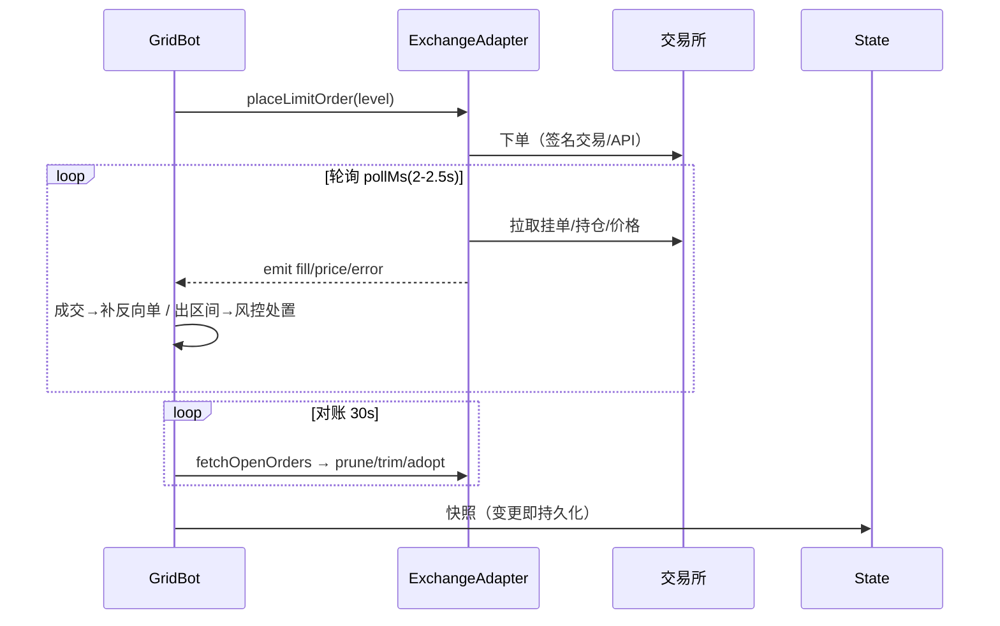

# 架构设计

## 总体架构
```mermaid
flowchart TD
    Client[浏览器仪表盘] -->|REST/SSE + Token| Web[server.js HTTP 服务]
    Web -->|鉴权守卫| API[/api/*]
    API --> Bot[GridBot x3]
    Bot --> Ex[ExchangeAdapter de/ex/rs]
    Ex --> SDK[交易所 SDK/API]
    Bot -->|持久化| State[.state.json 原子快照]
    AI[AiService] -->|定时巡检/日报| Bot
    AI --> LLM[第三方 AI 服务]
    Web -->|SSE 1s 推送| Client
    Bot -->|事件| Log[src/log.js 结构化日志]
```

## 技术栈
- **后端:** Node.js ≥20 ESM，原生 node:http（无框架）
- **前端:** 单文件 HTML/JS（public/index.html，无构建）
- **数据:** 无数据库；.env（配置）+ .state.json（快照，tmp+rename 原子写）+ logs/*.log
- **依赖:** @decibeltrade/sdk（Decibel）、@aptos-labs/ts-sdk、risex-client（RISEx，非官方）、undici（代理）；starkcrypto.js 为 Extended 手写零依赖签名

## 核心流程


## 重大架构决策
完整的ADR存储在各变更的how.md中，本章节提供索引。

| adr_id | title | date | status | affected_modules | details |
|--------|-------|------|--------|------------------|---------|
| ADR-001 | 静态令牌 + Origin/Host 校验鉴权 | 2026-08-14 | ✅已采纳 | web | [链接](../history/2026-08/202608141349_vps-hardening/how.md#adr-001) |
| ADR-002 | 自研 JSON lines 日志，不引入 pino | 2026-08-14 | ✅已采纳 | platform | [链接](../history/2026-08/202608141349_vps-hardening/how.md#adr-002) |
| ADR-003 | bot.js 测试沿用自研 runner | 2026-08-14 | ✅已采纳 | bot | [链接](../history/2026-08/202608141349_vps-hardening/how.md#adr-003) |
